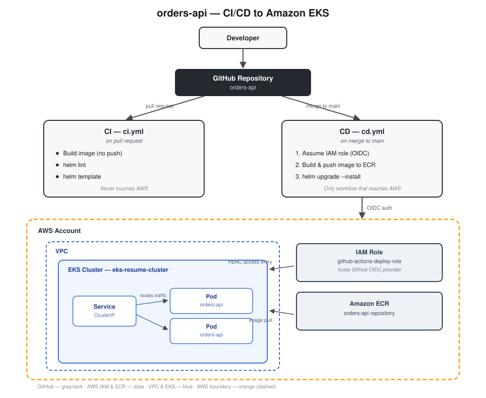

# orders-api — CI/CD to Amazon EKS

A CI/CD pipeline that builds a containerized Python service, pushes it to Amazon ECR, and deploys it to Amazon EKS via Helm — triggered automatically by GitHub Actions on every merge to `main`, authenticating to AWS with short-lived credentials via GitHub OIDC (no stored AWS keys). Infrastructure is provisioned with Terraform.

Part 2 of a portfolio series — see [Project 1](#) for the standalone VPC/EKS/Terraform build this project's infrastructure pattern is based on.
Note: you don't need to copy anthing from Project 1. Project 2 is a standalone project :)

## Architecture



- A pull request runs **CI** (`ci.yml`): builds the image to confirm it compiles, lints and renders the Helm chart. Never touches AWS.
- A merge to `main` runs **CD** (`cd.yml`): authenticates to AWS via OIDC, builds and pushes the image to ECR tagged with the commit SHA, then deploys with `helm upgrade --install`.

## Stack

| Layer | Tool |
|---|---|
| Infrastructure | Terraform (VPC, EKS, IAM, ECR, GitHub OIDC provider) |
| CI/CD | GitHub Actions |
| Container registry | Amazon ECR |
| AWS authentication | GitHub OIDC → IAM role (no static credentials) |
| Deployment | Helm |
| Runtime | Amazon EKS |
| App | Python / Flask |

## Repository structure

```
.
├── main.tf / variables.tf / outputs.tf / backend.tf / provider.tf
├── modules/
│   ├── vpc/
│   ├── iam/
│   └── eks/
├── app/                      # Flask demo service
│   ├── main.py
│   └── requirements.txt
├── Dockerfile
├── helm/app/                 # Helm chart
│   ├── Chart.yaml
│   ├── values.yaml
│   └── templates/
├── .github/workflows/
│   ├── ci.yml
│   └── cd.yml
└── docs/
    └── architecture.svg
```

## Running it

```bash
terraform init
terraform plan
terraform apply
```

Push to `main` to trigger the CD workflow, which builds, pushes, and deploys automatically.

## Notes

- Images are tagged with the git commit SHA, not `latest` — every deployed image is traceable to the exact commit that produced it.
- GitHub Actions authenticates to AWS via OIDC, scoped to a single IAM role with narrowly defined permissions — no long-lived credentials stored anywhere.
- ECR has `scan_on_push` enabled and a lifecycle policy limiting image retention.
